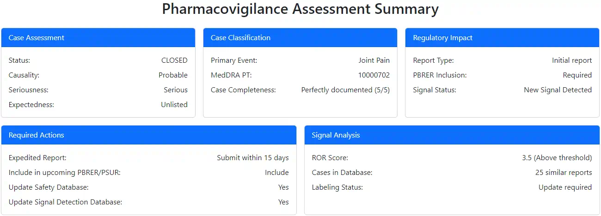

# Adverse Events

An AI-powered tool to analyze clinical trial descriptions and identify potential adverse events using multiple LLM models.

## Overview

This application uses LLMs to identify whether user feedback from a clinical trial is an adverse event or not.

It uses a workflow with multiple steps, where each step utilizes different models to evaluate the text for potential adverse events. Finally, it summarizes the results in a Pharmacovigilance assessment summary.

Here's a breakdown of the workflow:

1. **Context Analysis**: The basic model analyzes the clinical description to determine if there is any mention of an adverse event.
2. **BioClin Analysis**: An intermediate model performs a more detailed evaluation, considering clinical reasoning to assess the presence of adverse reactions.
3. **LLM as a Judge Analysis**: A specialized model acts as a judge, evaluating the feedback from the previous analyses based on predefined criteria.
4. **Judge Feedback to Context Analysis**: The judge provides feedback on the context analysis, which is then used to refine the initial evaluation.
5. **Judge Feedback to BioClin Analysis**: Similar to the previous step, the judge reviews the bio-clinical analysis and offers feedback for improvement.
6. **Context Analysis - Revised**: The basic model re-evaluates the clinical description, incorporating the judge's feedback to enhance its analysis.
7. **BioClin Analysis - Revised**: The intermediate model revisits its analysis, integrating the judge's feedback for a more accurate assessment.
8. **Judge Summary**: Finally, the judge summarizes the findings from all analyses, generating a comprehensive report that includes a pharmacovigilance assessment summary in JSON format.

This structured approach ensures a thorough evaluation of the clinical trial description, leveraging multiple models to enhance accuracy and reliability in identifying adverse events.


This structured approach ensures a thorough evaluation of the clinical trial description, leveraging multiple models to enhance accuracy and reliability in identifying adverse events.

## Screenshots

Analysis


Summary



## Features

- Multi-model analysis using various LLMs (OpenAI, Anthropic, Google, Cerebras, Groq)
- Three-tier evaluation system:
  - Basic analysis for quick adverse event detection
  - Intermediate analysis with step-by-step clinical expert reasoning
  - Advanced LLM judge analysis considering 15 clinical parameters
- Sample clinical trial descriptions for testing
- Dark mode support with auto/light/dark theme options
- Form persistence for saving user preferences
- Real-time streaming responses with progressive rendering
- Mobile-responsive Bootstrap 5.3 interface

## Usage

1. Select a sample clinical trial description or enter your own
2. Customize analysis settings (optional):
   - Modify prompts for each analysis tier
   - Select different LLM models for each evaluation
3. Click "Analyze" to get multi-model evaluation results
4. Review the layered analysis from basic to advanced judge evaluation

## Setup

### Prerequisites

- Modern web browser with JavaScript enabled
- Access to LLM Foundry API endpoints

### Local Setup

1. Clone this repository:

```bash
git clone https://github.com/gramener/adverseevents.git
cd adverseevents
```

2. Serve the files using any static web server. For example, using Python:

```bash
python -m http.server
```

3. Open `http://localhost:8000` in your web browser

## Deployment

On [Cloudflare DNS](https://dash.cloudflare.com/2c483e1dd66869c9554c6949a2d17d96/straive.app/dns/records),
proxy CNAME `adverseevents.straive.app` to `gramener.github.io`.

On this repository's [page settings](https://github.com/gramener/adverseevents/settings/pages), set

- Source: `Deploy from a branch`
- Branch: `main`
- Folder: `/`

## Technical Details

### Architecture

- Frontend: Vanilla JavaScript with lit-html for rendering
- LLM Integration: Multiple model providers through LLM Foundry API
- Styling: Bootstrap 5.3.3 with dark mode support

### Dependencies

- [lit-html](https://www.npmjs.com/package/lit-html) - Template rendering and DOM updates
- [marked](https://www.npmjs.com/package/marked) - Markdown parsing
- [asyncllm](https://www.npmjs.com/package/asyncllm) - Streaming LLM responses
- [Bootstrap](https://www.npmjs.com/package/bootstrap) - UI framework and styling
- [Bootstrap Icons](https://www.npmjs.com/package/bootstrap-icons) - Icon system
- [FormPersistence.js](https://www.npmjs.com/package/form-persistence) - Form state management

### LLM Models

Supports multiple AI models with varying costs:

- OpenAI: GPT-4 variants ($0.15-$5)
- Anthropic: Claude 3 models ($0.25-$3)
- Google: Gemini 1.5 models ($0.04-$1.25)
- Cerebras: Llama 3.1 models (Free)
- Groq: Various models including Llama 3.2, Gemma 2, Mixtral (Free)

## License

[MIT](LICENSE)
